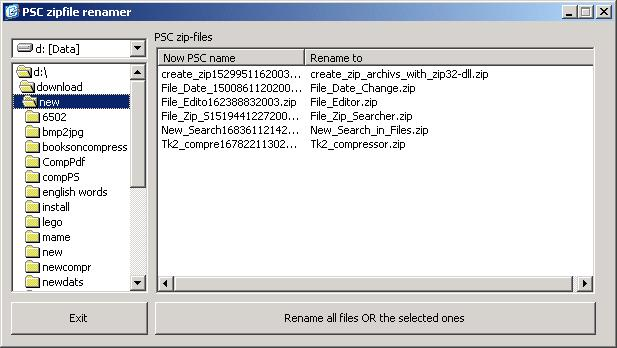



## PSC\-rename2

### Description

Last time i uploaded the file the PSC-demon removed the DLL. This one solves that problem couse it don't need a DLL.I only needed it for decompression but that is done in pure VB now. give it a try and let me now what you think of it.

For peaple who don't know what this is.

Whit this program you can rename the zipfiles from PSC (CODE_UPLOAD2354786.zip) to something more understandeble (PSC-Rename.zip)
 
### More Info
 

             |
---                |---
**Submitted On**   |2004-01-06 18:23:46
**By**             |[Marco v/d Berg](https://github.com/Planet-Source-Code/PSCIndex/blob/master/ByAuthor/marco-v-d-berg.md)
**Level**          |Advanced
**User Rating**    |5.0 (50 globes from 10 users)
**Compatibility**  |VB 6\.0
**Category**       |[Files/ File Controls/ Input/ Output](https://github.com/Planet-Source-Code/PSCIndex/blob/master/ByCategory/files-file-controls-input-output__1-3.md)
**World**          |[Visual Basic](https://github.com/Planet-Source-Code/PSCIndex/blob/master/ByWorld/visual-basic.md)
**Archive File**   |[PSC\-rename169117172004\.zip](https://github.com/Planet-Source-Code/marco-v-d-berg-psc-rename2__1-50835/archive/master.zip)

